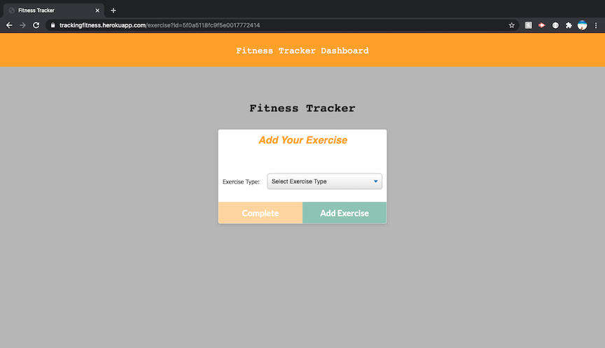
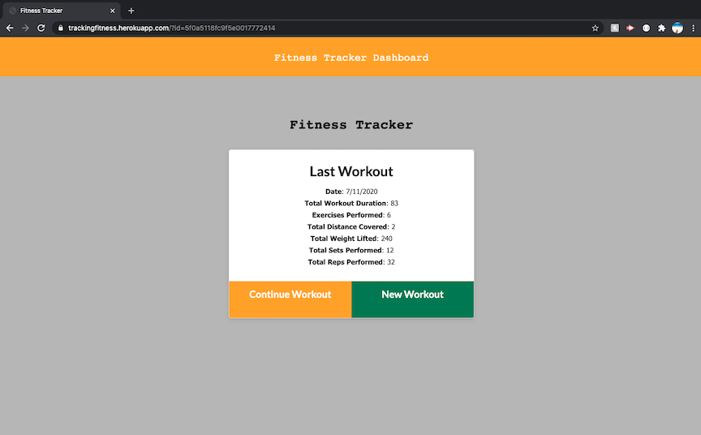
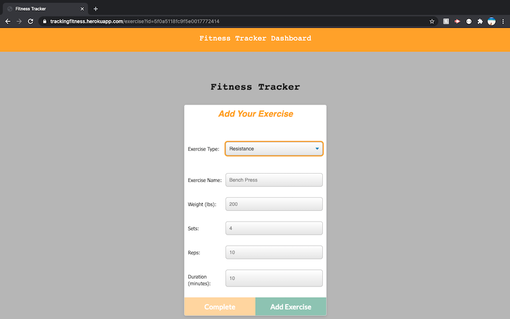
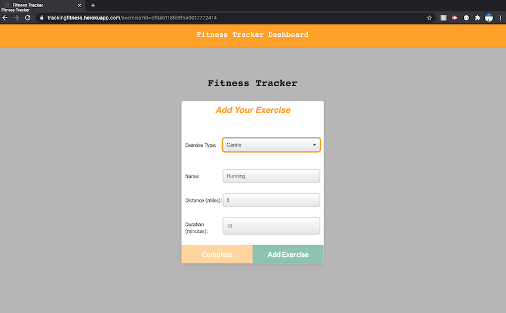

# FitnessTracker



## Description
A full stack workout tracking application using Mongo database with Mongoose schema and Express routes -- Allows a user to create, view, and track daily workouts. A user can log multiple exercises in a workout on a given day; with the ability to track the name, type, weight, sets, reps, and duration of exercise, with a cardio exercise the user can track distance traveled.

## Table of Contents

- [FitnessTracker](#fitnesstracker)
  - [Description](#description)
  - [Table of Contents](#table-of-contents)
  - [Installation](#installation)
  - [Contributing](#contributing)






## Installation
``` npm install ```

## Contributing
Contact Me
